# Mermaid Diagram Source — Frontend Chapter, Dawava Pharmacy Portal

Each block corresponds to the figure of the same number in `Graduation_Project_Report.md`. Twelve diagrams in total (Figures 1, 2, 3, 4, 6, 8, 11, 13, 16, 18, 20, 22); the remaining figure numbers are screenshot placeholders described directly in the report text.

## Figure 1 – Overall System Architecture

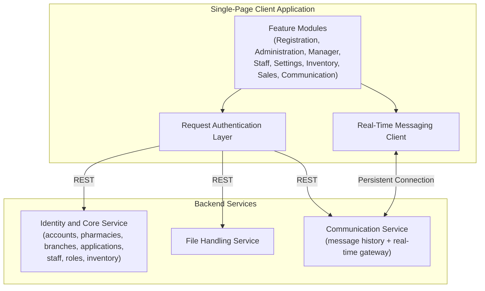

## Figure 2 – Frontend Modular Architecture

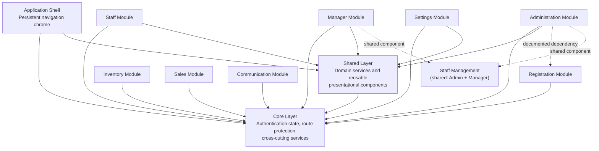

## Figure 3 – Authentication and Session Flow

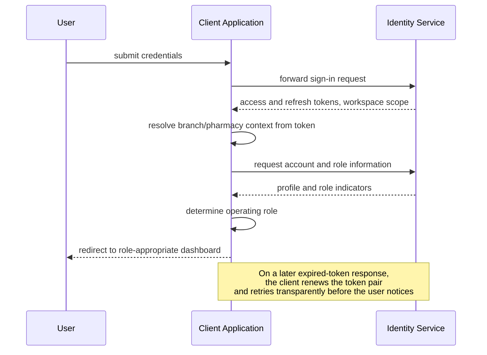

## Figure 4 – Role-Based Access Control Flow

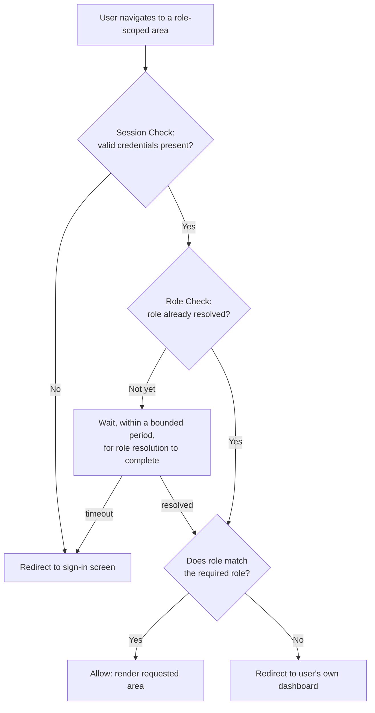

## Figure 6 – Onboarding Application Workflow

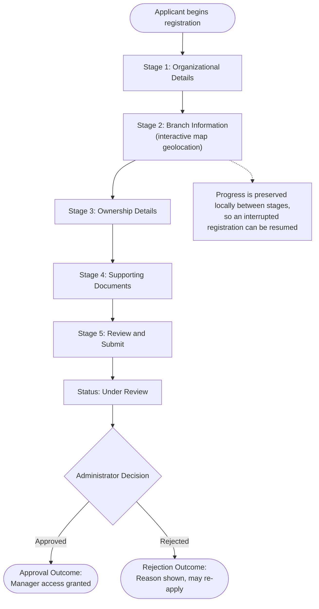

## Figure 8 – Administrator Review and Approval Workflow

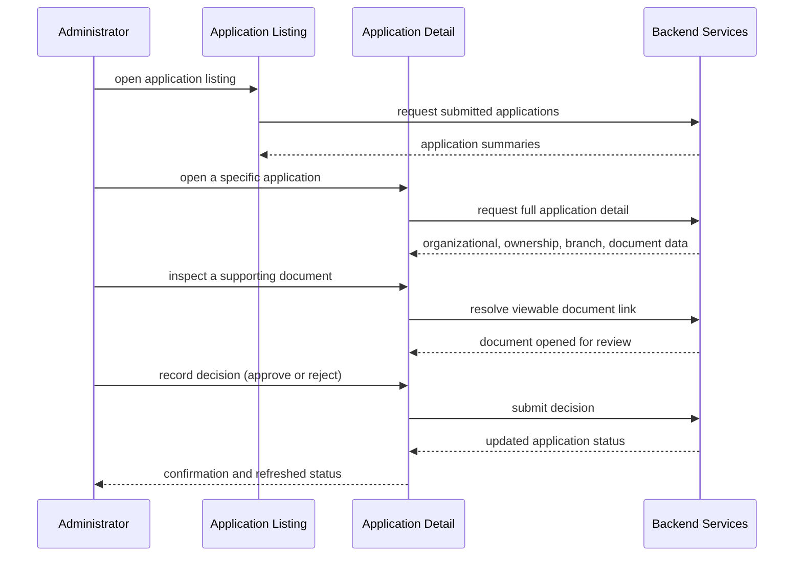

## Figure 11 – Branch and Pharmacy Management Workflow

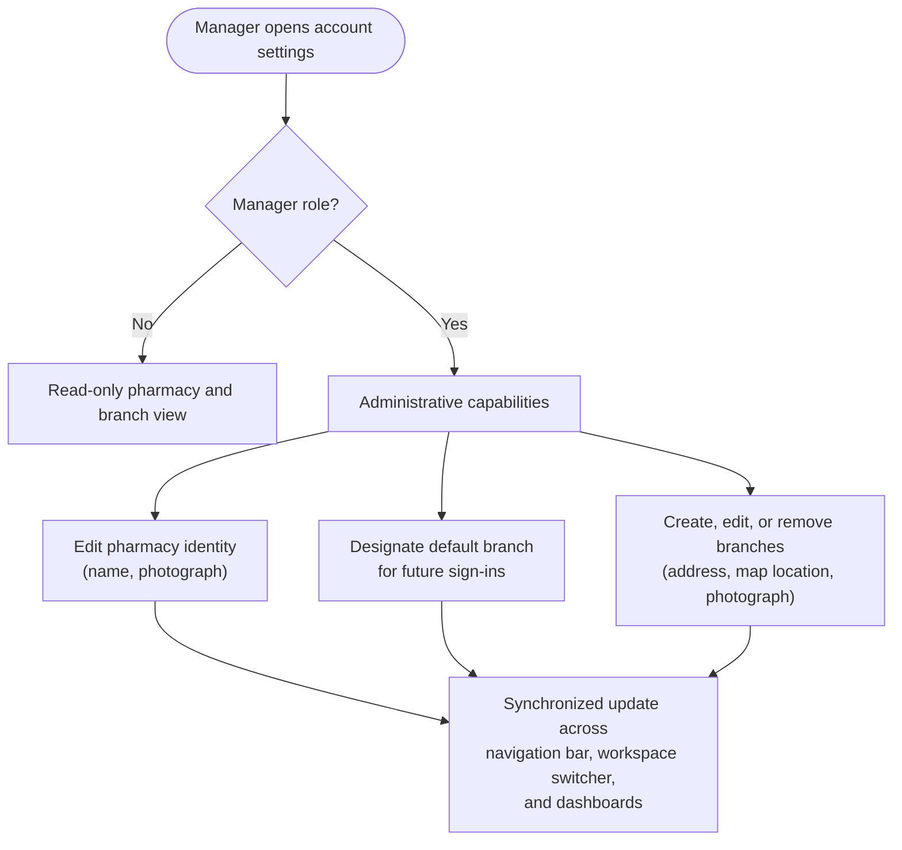

## Figure 13 – Real-Time Chat Communication Workflow

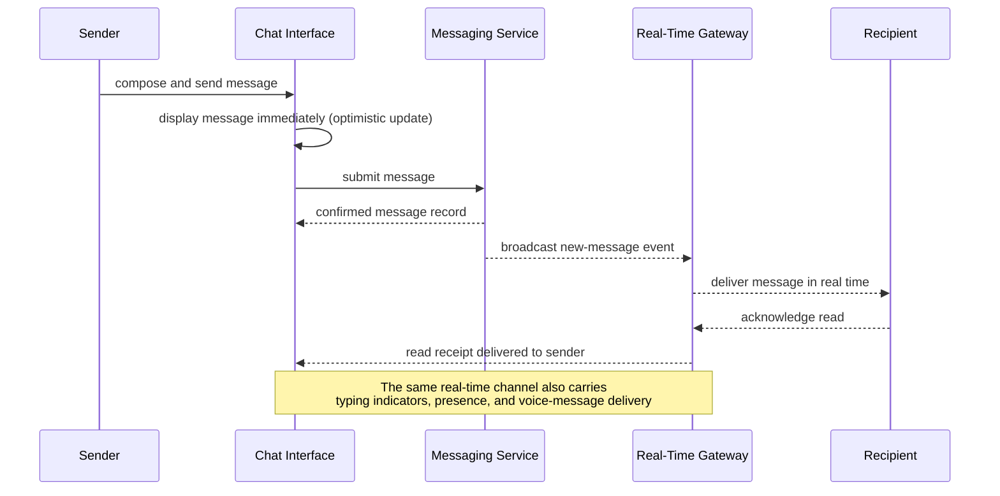

## Figure 16 – Inventory and Sales Data Workflow

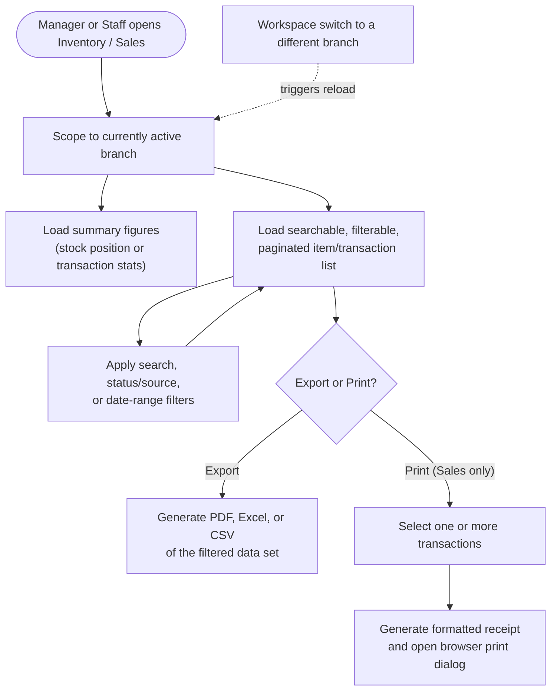

## Figure 18 – Staff Invitation Lifecycle

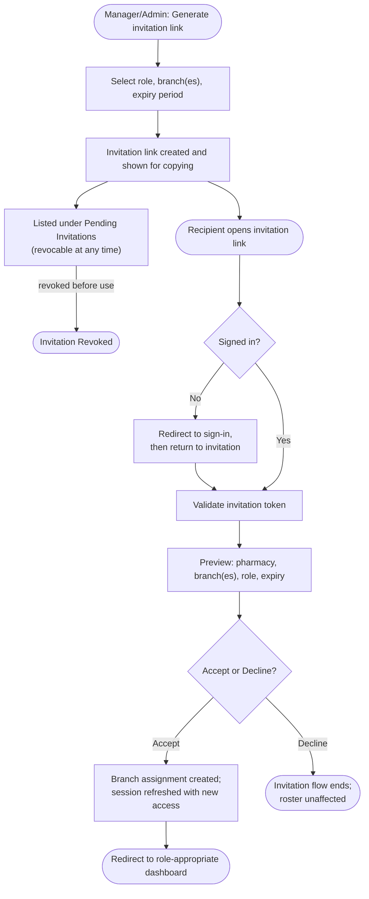

## Figure 20 – Role and Permission Management Workflow

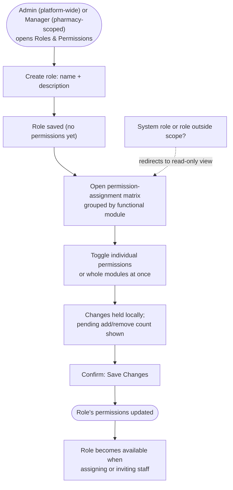

## Figure 22 – Client–Backend Communication and File Handling Flow

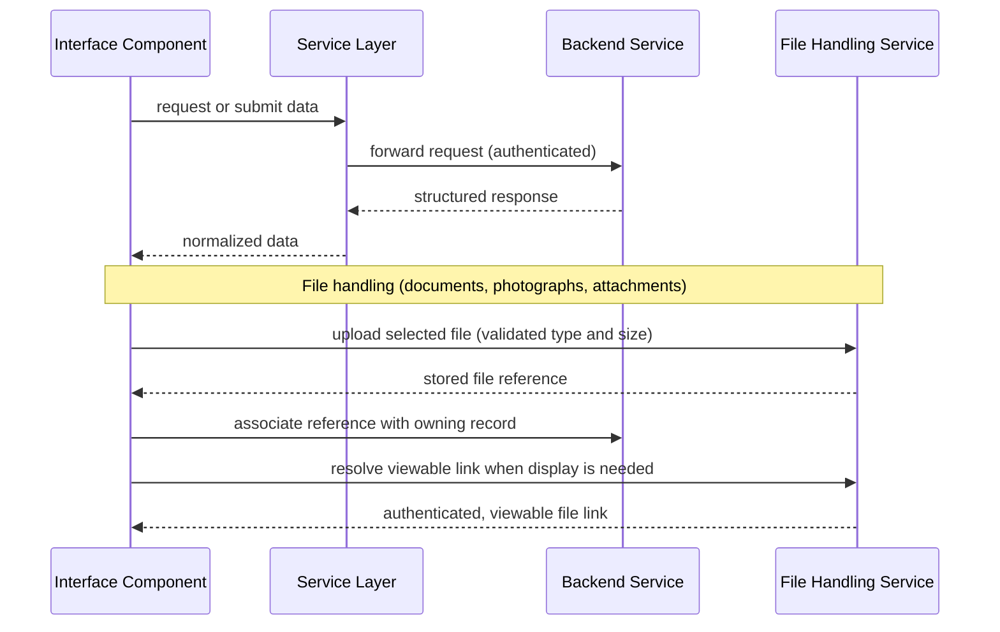
